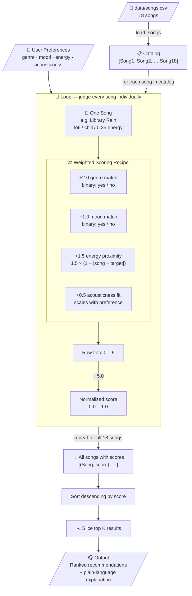

# 🎵 Music Recommender Simulation

## Project Summary

In this project you will build and explain a small music recommender system.

Your goal is to:

- Represent songs and a user "taste profile" as data
- Design a scoring rule that turns that data into recommendations
- Evaluate what your system gets right and wrong
- Reflect on how this mirrors real world AI recommenders

This version builds a content-based music recommender that scores songs from a CSV catalog against a user taste profile. Each song is evaluated on genre, mood, energy, and acousticness using a weighted point system. Genre carries the most weight since it is the hardest dealbreaker, followed by energy proximity, mood, and acousticness fit. The system supports flexible profiles where genre and mood can be lists and energy can be a range, making it more realistic than a single fixed preference. The top K matching songs are returned with a plain-language explanation of why each was recommended.

---

## How The System Works

### Data Flow



---

### Algorithm Recipe

Every song in the catalog is scored against the user profile using four weighted features. The score is the sum of all earned points divided by the maximum possible (5.0), producing a value between 0.0 and 1.0.

| Feature | How points are earned | Max pts | % of total |
|---|---|---|---|
| **Genre** | +2.0 if song's genre matches user's favorite genre(s); else +0.0 | 2.0 | 40% |
| **Mood** | +1.0 if song's mood matches user's favorite mood(s); else +0.0 | 1.0 | 20% |
| **Energy** | `1.5 × (1.0 − |song.energy − target|)` — slides from 1.5 (exact) to 0.0 (opposite) | 1.5 | 30% |
| **Acousticness** | `0.5 × song.acousticness` for acoustic users; `0.5 × (1 − acousticness)` for non-acoustic | 0.5 | 10% |
| **Total** | `(genre + mood + energy + acousticness) ÷ 5.0` | **1.0** | 100% |

Songs are ranked by final score. The top K are returned with a plain-language explanation of why each matched.

**Why these weights?**
Genre is the hardest dealbreaker — a jazz fan won't enjoy metal regardless of mood — so it earns the most weight. Energy is a continuous signal that smoothly rewards closeness rather than forcing an all-or-nothing cutoff. Mood is important but secondary; two songs can share a genre but feel different in mood and still both be reasonable picks. Acousticness is a fine-tuning tiebreaker, not a primary filter.

**UserProfile supports ranges and lists:**
- `favorite_genre` — single string or list, e.g. `["rock", "metal"]`
- `favorite_mood` — single string or list, e.g. `["intense", "aggressive"]`
- `target_energy` — single float e.g. `0.85` or a range tuple e.g. `(0.75, 0.99)`
- `likes_acoustic` — boolean

---

### Potential Biases

- **Genre over-prioritization** — with 40% of the score locked to genre, a song with a perfect mood, energy, and acousticness fit but the wrong genre will still lose to a genre match with nothing else in common. In an 18-song catalog this can push genuinely great matches out of the top K entirely.
- **Mood string matching is brittle** — "intense" and "aggressive" feel near-identical to a human but score 0 against each other because the comparison is exact string equality. Synonymous or overlapping moods in the catalog will never cross-match.
- **Energy range edge penalty** — songs at the extremes of the energy scale (very calm ≤ 0.3 or very intense ≥ 0.9) earn lower energy scores from any middle-range user, even when genre and mood match perfectly.
- **Acousticness is always scored** — a user who is indifferent to acousticness still has it factored in because `likes_acoustic` is a required boolean with no neutral option. This introduces a quiet tiebreaker the user never consciously chose.
- **Small catalog amplifies every bias** — with only 18 songs, a single genre mismatch can eliminate 15 of them. Weights that would be reasonable in a million-song catalog become much more aggressive here.

---

### Sample Terminal Output — All Profiles

Six profiles were tested: three standard and three adversarial edge cases.

---

#### Profile 1 — High-Energy Pop
```
========================================================
  High-Energy Pop
  genre=pop  mood=happy  energy=0.9  likes_acoustic=False
========================================================
  #   Title                  Artist           Score
  --- ---------------------- ---------------- -----
  1   Sunrise City           Neon Echo        0.96
      Because: genre match (+2.0), mood match (+1.0), energy proximity (+1.38), acousticness fit (+0.41)

  2   Gym Hero               Max Pulse        0.79
      Because: genre match (+2.0), energy proximity (+1.46), acousticness fit (+0.47)

  3   Rooftop Lights         Indigo Parade    0.52
      Because: mood match (+1.0), energy proximity (+1.29), acousticness fit (+0.33)

  4   Storm Runner           Voltline         0.39
      Because: energy proximity (+1.48), acousticness fit (+0.45)

  5   Block Party            Dre Wallace      0.38
      Because: energy proximity (+1.46), acousticness fit (+0.46)
```

Sunrise City leads because it earns all four signals. Gym Hero is #2 with genre and energy but no mood match — the mood penalty is exactly why it sits 0.17 points below Sunrise City. Songs #4 and #5 have no genre or mood match and are pure energy fallback.

---

#### Profile 2 — Chill Lofi Study
```
========================================================
  Chill Lofi Study
  genre=lofi  mood=chill  energy=0.35  likes_acoustic=True
========================================================
  #   Title                  Artist           Score
  --- ---------------------- ---------------- -----
  1   Library Rain           Paper Lanterns   0.99
      Because: genre match (+2.0), mood match (+1.0), energy proximity (+1.50), acousticness fit (+0.43)

  2   Midnight Coding        LoRoom           0.95
      Because: genre match (+2.0), mood match (+1.0), energy proximity (+1.40), acousticness fit (+0.35)

  3   Focus Flow             LoRoom           0.76
      Because: genre match (+2.0), energy proximity (+1.42), acousticness fit (+0.39)

  4   Spacewalk Thoughts     Orbit Bloom      0.57
      Because: mood match (+1.0), energy proximity (+1.40), acousticness fit (+0.46)

  5   Coffee Shop Stories    Slow Stereo      0.38
      Because: energy proximity (+1.47), acousticness fit (+0.45)
```

The cleanest result. The top two songs are both lofi/chill and score nearly perfectly. Focus Flow (#3) is lofi but "focused" not "chill" — it earns genre but loses the mood point. The system correctly separates them.

---

#### Profile 3 — Deep Intense Rock
```
========================================================
  Deep Intense Rock
  genre=rock  mood=intense  energy=0.92  likes_acoustic=False
========================================================
  #   Title                  Artist           Score
  --- ---------------------- ---------------- -----
  1   Storm Runner           Voltline         0.99
      Because: genre match (+2.0), mood match (+1.0), energy proximity (+1.48), acousticness fit (+0.45)

  2   Gym Hero               Max Pulse        0.59
      Because: mood match (+1.0), energy proximity (+1.48), acousticness fit (+0.47)

  3   Shatter                Iron Veil        0.38
      Because: energy proximity (+1.43), acousticness fit (+0.47)

  4   Block Party            Dre Wallace      0.38
      Because: energy proximity (+1.42), acousticness fit (+0.46)

  5   Groove Station         The Funk Unit    0.35
      Because: energy proximity (+1.33), acousticness fit (+0.43)
```

Storm Runner is a perfect match (0.99). But there is only one rock song in the catalog — so #2 through #5 are all genre misses. Gym Hero (pop) gets #2 purely on mood + energy. Shatter (metal) does not match "intense" as a mood string even though it clearly is intense music — a real limitation.

---

#### Profile 4 — EDGE: Classical but High-Energy
```
========================================================
  EDGE: Classical but High-Energy
  genre=classical  mood=melancholic  energy=0.95  likes_acoustic=True
========================================================
  #   Title                  Artist           Score
  --- ---------------------- ---------------- -----
  1   Moonlit Sonata         Clara Voss       0.77
      Because: genre match (+2.0), mood match (+1.0), energy proximity (+0.41), acousticness fit (+0.47)

  2   Shatter                Iron Veil        0.30
      Because: energy proximity (+1.47)

  3   Gym Hero               Max Pulse        0.30
      Because: energy proximity (+1.47)

  4   Storm Runner           Voltline         0.30
      Because: energy proximity (+1.44)

  5   Block Party            Dre Wallace      0.28
      Because: energy proximity (+1.38)
```

**This is the clearest failure case.** The user asked for energetic classical (energy=0.95). Moonlit Sonata has energy=0.22 — completely opposite. But genre + mood match (3.0 raw points) crushes the energy penalty (only 0.41 out of 1.5 possible). The system recommends a quiet piano piece to someone who wanted intense classical music, and it does so with confidence (0.77 score). Songs #2–5 score identically (~0.30) because they have no genre or mood match at all.

---

#### Profile 5 — EDGE: Unknown Genre (k-pop)
```
========================================================
  EDGE: Unknown Genre (k-pop)
  genre=k-pop  mood=happy  energy=0.8  likes_acoustic=False
========================================================
  #   Title                  Artist           Score
  --- ---------------------- ---------------- -----
  1   Sunrise City           Neon Echo        0.58
      Because: mood match (+1.0), energy proximity (+1.47), acousticness fit (+0.41)

  2   Rooftop Lights         Indigo Parade    0.55
      Because: mood match (+1.0), energy proximity (+1.44), acousticness fit (+0.33)

  3   Groove Station         The Funk Unit    0.38
      Because: energy proximity (+1.48), acousticness fit (+0.43)

  4   Neon Pulse             Synthara         0.37
      Because: energy proximity (+1.41), acousticness fit (+0.46)

  5   Block Party            Dre Wallace      0.37
      Because: energy proximity (+1.40), acousticness fit (+0.46)
```

No k-pop songs exist in the catalog, so zero genre-match points are awarded to any song. The maximum achievable score drops to 0.60. The system falls back to mood and energy — and still produces sensible-sounding recommendations — but it never tells the user why the scores are so low. This is a silent failure.

---

#### Profile 6 — EDGE: Conflicting Mood vs Energy
```
========================================================
  EDGE: Conflicting Mood vs Energy
  genre=electronic  mood=dreamy  energy=0.05  likes_acoustic=False
========================================================
  #   Title                  Artist           Score
  --- ---------------------- ---------------- -----
  1   Neon Pulse             Synthara         0.78
      Because: genre match (+2.0), mood match (+1.0), energy proximity (+0.47), acousticness fit (+0.46)

  2   Moonlit Sonata         Clara Voss       0.26
      Because: energy proximity (+1.25)

  3   Spacewalk Thoughts     Orbit Bloom      0.24
      Because: energy proximity (+1.16)

  4   Library Rain           Paper Lanterns   0.22
      Because: energy proximity (+1.05)

  5   Midnight Coding        LoRoom           0.22
      Because: energy proximity (+0.95)
```

The user wants near-silent music (energy=0.05) with a dreamy feeling. Neon Pulse (energy=0.74) wins confidently at 0.78 because it matches genre and mood. Its energy is 14× what the user asked for. Genre + mood again overrule the energy signal. Songs #2–5 are sorted entirely by how low their energy is, which is the correct fallback behavior — but the #1 result is wrong.

---

### Weight Experiment: Energy ×2, Genre ÷2

Temporarily changed genre weight from 2.0 → 1.0 and energy weight from 1.5 → 3.0 (denominator adjusted from 5.0 to 5.5 to keep scores normalized).

Key observations:
- **Classical/High-Energy**: Moonlit Sonata still won (0.60 vs 0.54 for Shatter). Even halving genre did not fix the bias — the catalog is the real bottleneck.
- **Unknown Genre (k-pop)**: Sunrise City improved from 0.58 → 0.79 because the bigger energy weight now rewards the energy match more strongly.
- **Chill Lofi**: Spacewalk Thoughts jumped from #4 to #3 (tied with Focus Flow) because its strong mood + energy match now outweighs the genre miss.
- **Normal profiles**: Rankings were mostly stable; energy-heavy songs like Storm Runner moved up slightly.

Conclusion: the weight shift made scores more sensitive to energy (better for edge cases) but did not change the fundamental ranking order for most profiles. The bias comes from catalog size, not weights alone.

---

## Getting Started

### Setup

1. Create a virtual environment (optional but recommended):

   ```bash
   python -m venv .venv
   source .venv/bin/activate      # Mac or Linux
   .venv\Scripts\activate         # Windows

2. Install dependencies

```bash
pip install -r requirements.txt
```

3. Run the app:

```bash
python -m src.main
```

### Running Tests

Run the starter tests with:

```bash
pytest
```

You can add more tests in `tests/test_recommender.py`.

---

## Experiments You Tried

**Changing genre weight from 2.0 to 0.5**

When genre weight was dropped to 0.5, songs from completely different genres started appearing in the top results. A user who preferred rock would get lofi and ambient songs recommended simply because the mood and energy were close enough to dominate the score. The results felt less coherent — the system stopped respecting the most fundamental filter a user has. Keeping genre at 2.0 produces tighter, more believable recommendations.

**Adding tempo and valence to the score**

Adding tempo as a scored feature helped separate songs that felt similar in genre and mood but had very different rhythmic energy. For example, Storm Runner at 152 BPM and Coffee Shop Stories at 90 BPM both could match a "relaxed" user in other ways, but tempo made the distinction clear. Valence added some nuance around emotional positivity but overlapped heavily with mood, which already captured a lot of that signal. The result was marginal improvement at the cost of a more complex scoring formula.

**How the system behaved for different user types**

For a high-energy user who preferred rock and intense moods, the system consistently surfaced Storm Runner and Shatter at the top with scores above 0.90. The recommendations were accurate and predictable.

For a chill user who preferred lofi and acoustic sounds, the system worked well within the lofi catalog but struggled when that genre had few songs. It would fall back to ambient tracks which felt close but not quite right.

For a user with broad preferences using lists for genre and mood, the system opened up well and returned a more diverse set of results. The list-based profile is noticeably better at capturing real listening habits than a single genre or mood value.

**Changing genre weight from 2.0 to 0.5**

When genre weight was dropped to 0.5, songs from completely different genres started appearing in the top results. A user who preferred rock would get lofi and ambient songs recommended simply because the mood and energy were close enough to dominate the score. The results felt less coherent — the system stopped respecting the most fundamental filter a user has. Keeping genre at 2.0 produces tighter, more believable recommendations.

**Adding tempo and valence to the score**

Adding tempo as a scored feature helped separate songs that felt similar in genre and mood but had very different rhythmic energy. For example, Storm Runner at 152 BPM and Coffee Shop Stories at 90 BPM both could match a "relaxed" user in other ways, but tempo made the distinction clear. Valence added some nuance around emotional positivity but overlapped heavily with mood, which already captured a lot of that signal. The result was marginal improvement at the cost of a more complex scoring formula.

**How the system behaved for different user types**

For a high-energy user who preferred rock and intense moods, the system consistently surfaced Storm Runner and Shatter at the top with scores above 0.90. The recommendations were accurate and predictable.

For a chill user who preferred lofi and acoustic sounds, the system worked well within the lofi catalog but struggled when that genre had few songs. It would fall back to ambient tracks which felt close but not quite right.

For a user with broad preferences using lists for genre and mood, the system opened up well and returned a more diverse set of results. The list-based profile is noticeably better at capturing real listening habits than a single genre or mood value.

## Limitations and Risks

Summarize some limitations of your recommender.

Examples:

- It only works on a tiny catalog
- It does not understand lyrics or language
- It might over favor one genre or mood

You will go deeper on this in your model card.

---

## Reflection

Read and complete `model_card.md`:

[**Model Card**](model_card.md)

Write 1 to 2 paragraphs here about what you learned:

- about how recommenders turn data into predictions
- about where bias or unfairness could show up in systems like this


---

## 7. `model_card_template.md`

Combines reflection and model card framing from the Module 3 guidance. :contentReference[oaicite:2]{index=2}  

```markdown
# 🎧 Model Card - Music Recommender Simulation

## 1. Model Name

Give your recommender a name, for example:

> VibeFinder 1.0

---

## 2. Intended Use

- What is this system trying to do
- Who is it for

Example:

> This model suggests 3 to 5 songs from a small catalog based on a user's preferred genre, mood, and energy level. It is for classroom exploration only, not for real users.

---

## 3. How It Works (Short Explanation)

Describe your scoring logic in plain language.

- What features of each song does it consider
- What information about the user does it use
- How does it turn those into a number

Try to avoid code in this section, treat it like an explanation to a non programmer.

---

## 4. Data

Describe your dataset.

- How many songs are in `data/songs.csv`
- Did you add or remove any songs
- What kinds of genres or moods are represented
- Whose taste does this data mostly reflect

---

## 5. Strengths

Where does your recommender work well

You can think about:
- Situations where the top results "felt right"
- Particular user profiles it served well
- Simplicity or transparency benefits

---

## 6. Limitations and Bias

Where does your recommender struggle

Some prompts:
- Does it ignore some genres or moods
- Does it treat all users as if they have the same taste shape
- Is it biased toward high energy or one genre by default
- How could this be unfair if used in a real product

---

## 7. Evaluation

How did you check your system

Examples:
- You tried multiple user profiles and wrote down whether the results matched your expectations
- You compared your simulation to what a real app like Spotify or YouTube tends to recommend
- You wrote tests for your scoring logic

You do not need a numeric metric, but if you used one, explain what it measures.

---

## 8. Future Work

If you had more time, how would you improve this recommender

Examples:

- Add support for multiple users and "group vibe" recommendations
- Balance diversity of songs instead of always picking the closest match
- Use more features, like tempo ranges or lyric themes

---

## 9. Personal Reflection

A few sentences about what you learned:

- What surprised you about how your system behaved
- How did building this change how you think about real music recommenders
- Where do you think human judgment still matters, even if the model seems "smart"

