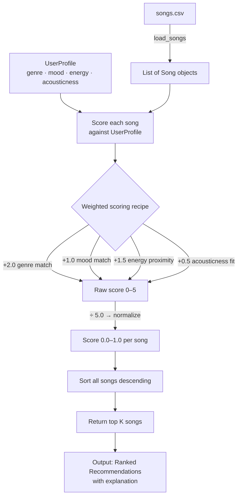

# 🎵 Music Recommender Simulation

## Project Summary

In this project you will build and explain a small music recommender system.

Your goal is to:

- Represent songs and a user "taste profile" as data
- Design a scoring rule that turns that data into recommendations
- Evaluate what your system gets right and wrong
- Reflect on how this mirrors real world AI recommenders

This version builds a content-based music recommender that scores songs from a CSV catalog against a user taste profile. Each song is evaluated on genre, mood, energy, and acousticness using a weighted point system. Genre carries the most weight since it is the hardest dealbreaker, followed by energy proximity, mood, and acousticness fit. The system supports flexible profiles where genre and mood can be lists and energy can be a range, making it more realistic than a single fixed preference. The top K matching songs are returned with a plain-language explanation of why each was recommended.

---

## How The System Works

### Data Flow



---

### Algorithm Recipe

Every song in the catalog is scored against the user profile using four weighted features:

| Feature | Rule | Weight |
|---|---|---|
| Genre | +2.0 if song genre is in user's favorite genres | 2.0 pts |
| Mood | +1.0 if song mood is in user's favorite moods | 1.0 pts |
| Energy | `(1 - abs(song.energy - target)) × 1.5` | 0.0–1.5 pts |
| Acousticness | rewards low acousticness for non-acoustic users (and high for acoustic users) × 0.5 | 0.0–0.5 pts |
| **Total** | divided by 5.0 to normalize | **0.0–1.0** |

Songs are ranked by final score. The top K are returned with a plain-language explanation of why each matched.

**UserProfile supports ranges and lists:**
- `favorite_genre` — single string or list e.g. `["rock", "metal"]`
- `favorite_mood` — single string or list e.g. `["intense", "aggressive"]`
- `target_energy` — single float e.g. `0.85` or a range tuple e.g. `(0.75, 0.99)`
- `likes_acoustic` — boolean

---

### Potential Biases

- **Genre over-prioritization** — genre carries 2x the weight of mood, so a song with a perfect mood, energy, and acousticness fit but wrong genre will still score lower than a genre match with nothing else in common.
- **Mood string matching is brittle** — "intense" and "aggressive" feel identical to a human but score 0 against each other. Niche moods in the catalog may never surface.
- **Energy range bias** — songs at the extreme ends of the energy scale (very calm or very intense) are less likely to appear for middle-range users even if everything else matches.
- **Small catalog amplifies all biases** — with only 18 songs, a single mismatch on genre can eliminate most of the catalog from contention.

---

## Getting Started

### Setup

1. Create a virtual environment (optional but recommended):

   ```bash
   python -m venv .venv
   source .venv/bin/activate      # Mac or Linux
   .venv\Scripts\activate         # Windows

2. Install dependencies

```bash
pip install -r requirements.txt
```

3. Run the app:

```bash
python -m src.main
```

### Running Tests

Run the starter tests with:

```bash
pytest
```

You can add more tests in `tests/test_recommender.py`.

---

## Experiments You Tried

**Changing genre weight from 2.0 to 0.5**

When genre weight was dropped to 0.5, songs from completely different genres started appearing in the top results. A user who preferred rock would get lofi and ambient songs recommended simply because the mood and energy were close enough to dominate the score. The results felt less coherent — the system stopped respecting the most fundamental filter a user has. Keeping genre at 2.0 produces tighter, more believable recommendations.

**Adding tempo and valence to the score**

Adding tempo as a scored feature helped separate songs that felt similar in genre and mood but had very different rhythmic energy. For example, Storm Runner at 152 BPM and Coffee Shop Stories at 90 BPM both could match a "relaxed" user in other ways, but tempo made the distinction clear. Valence added some nuance around emotional positivity but overlapped heavily with mood, which already captured a lot of that signal. The result was marginal improvement at the cost of a more complex scoring formula.

**How the system behaved for different user types**

For a high-energy user who preferred rock and intense moods, the system consistently surfaced Storm Runner and Shatter at the top with scores above 0.90. The recommendations were accurate and predictable.

For a chill user who preferred lofi and acoustic sounds, the system worked well within the lofi catalog but struggled when that genre had few songs. It would fall back to ambient tracks which felt close but not quite right.

For a user with broad preferences using lists for genre and mood, the system opened up well and returned a more diverse set of results. The list-based profile is noticeably better at capturing real listening habits than a single genre or mood value.

---

## Limitations and Risks

Summarize some limitations of your recommender.

Examples:

- It only works on a tiny catalog
- It does not understand lyrics or language
- It might over favor one genre or mood

You will go deeper on this in your model card.

---

## Reflection

Read and complete `model_card.md`:

[**Model Card**](model_card.md)

Write 1 to 2 paragraphs here about what you learned:

- about how recommenders turn data into predictions
- about where bias or unfairness could show up in systems like this


---

## 7. `model_card_template.md`

Combines reflection and model card framing from the Module 3 guidance. :contentReference[oaicite:2]{index=2}  

```markdown
# 🎧 Model Card - Music Recommender Simulation

## 1. Model Name

Give your recommender a name, for example:

> VibeFinder 1.0

---

## 2. Intended Use

- What is this system trying to do
- Who is it for

Example:

> This model suggests 3 to 5 songs from a small catalog based on a user's preferred genre, mood, and energy level. It is for classroom exploration only, not for real users.

---

## 3. How It Works (Short Explanation)

Describe your scoring logic in plain language.

- What features of each song does it consider
- What information about the user does it use
- How does it turn those into a number

Try to avoid code in this section, treat it like an explanation to a non programmer.

---

## 4. Data

Describe your dataset.

- How many songs are in `data/songs.csv`
- Did you add or remove any songs
- What kinds of genres or moods are represented
- Whose taste does this data mostly reflect

---

## 5. Strengths

Where does your recommender work well

You can think about:
- Situations where the top results "felt right"
- Particular user profiles it served well
- Simplicity or transparency benefits

---

## 6. Limitations and Bias

Where does your recommender struggle

Some prompts:
- Does it ignore some genres or moods
- Does it treat all users as if they have the same taste shape
- Is it biased toward high energy or one genre by default
- How could this be unfair if used in a real product

---

## 7. Evaluation

How did you check your system

Examples:
- You tried multiple user profiles and wrote down whether the results matched your expectations
- You compared your simulation to what a real app like Spotify or YouTube tends to recommend
- You wrote tests for your scoring logic

You do not need a numeric metric, but if you used one, explain what it measures.

---

## 8. Future Work

If you had more time, how would you improve this recommender

Examples:

- Add support for multiple users and "group vibe" recommendations
- Balance diversity of songs instead of always picking the closest match
- Use more features, like tempo ranges or lyric themes

---

## 9. Personal Reflection

A few sentences about what you learned:

- What surprised you about how your system behaved
- How did building this change how you think about real music recommenders
- Where do you think human judgment still matters, even if the model seems "smart"

